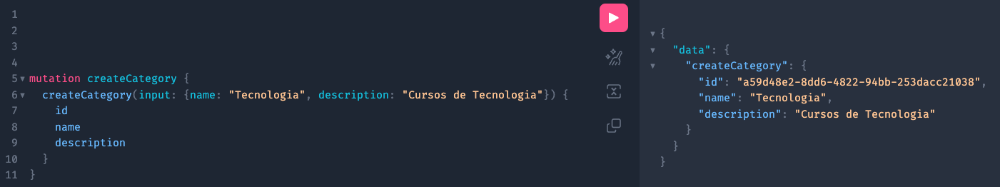
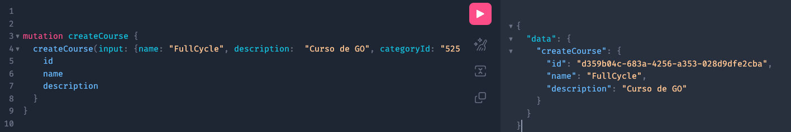
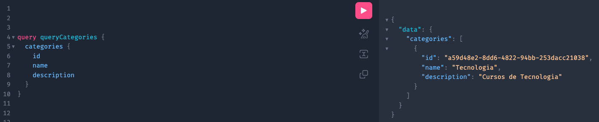
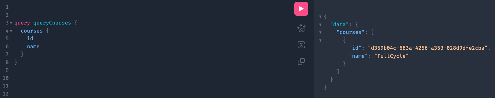
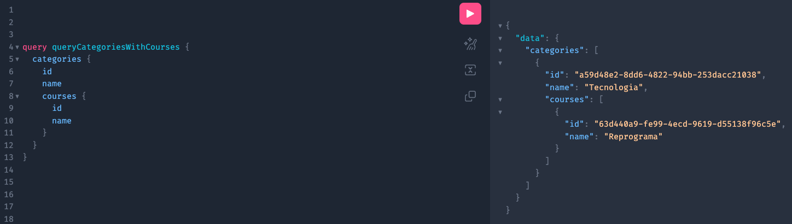
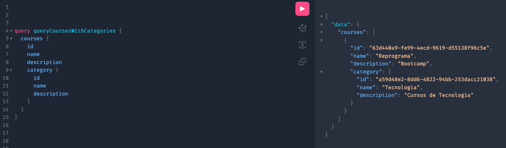

# fullcycle_graphql

---

## expondo aplicacao com graphql
site: https://gqlgen.com/

---

Estrutura graphql criada com gqlgen

## Inicia

```bash
go mod init github.com/bianavic/fullcycle_graphql 
```

## Instala Tools

```bash
 printf '//go:build tools\npackage tools\nimport (_ "github.com/99designs/gqlgen"\n _ "github.com/99designs/gqlgen/graphql/introspection")' | gofmt > tools.go
```

## Baixa pacotes

```bash
 go mod tidy
```

## Inicia gqlgen config e gera esquelto do projeto

```bash
go run github.com/99designs/gqlgen init
```

```bash
go run github.com/99designs/gqlgen generate
```

## Criar tabelas no banco de dados

1- Categories
```sql3
CREATE TABLE categories (
    id string,
    name string,
    description string
);
```

2- Courses
```sql3
CREATE TABLE courses (
    id string,
    name string,
    description string
);
```

## Inicia server

```bash
go run server.go
```

## Acessa GraphQL Playground

```bash
http://localhost:8080/
```

1-criar categorias
```graphql
mutation createCategory {
    createCategory(input: {name: "Tecnologia", description: "Cursos de Tecnologia"}) {
        id
        name
        description
    }
}
```


2-criar cursos
```graphql
mutation createCourse {
    createCourse(input: {name: "Reprograma", description:  "Bootcamp", categoryId: "a59d48e2-8dd6-4822-94bb-253dacc21038"}) {
        id
        name
        description
    }
}
```


3-buscar categorias
```graphql
query queryCategories {
    categories {
        id
        name
        description
    }
}
```


4-buscar cursos
```graphql
query queryCourses {
    courses {
        id
        name
    }
}
```


5-todos os cursos de uma categoria
```graphql
query queryCategoriesWithCourses {
    categories {
        id
        name
        courses {
            id
            name
        }
    }
}
```


6-buscar todas a categoria de um curso
```graphql
query queryCoursesWithCategories {
    courses {
        id
        name
        description
        category {
            id
            name
            description
        }
    }
}
```



OBS:
- Criar arquivo schema.graphqls
- Rodar comando go run github.com/99designs/gqlgen generate
- Executa resolver para implementar os metodos
- Rodar comando go run server.go
- Acessar http://localhost:8080/ para testar
OBS: O playground irá apresentar `Mutation` e `Query`